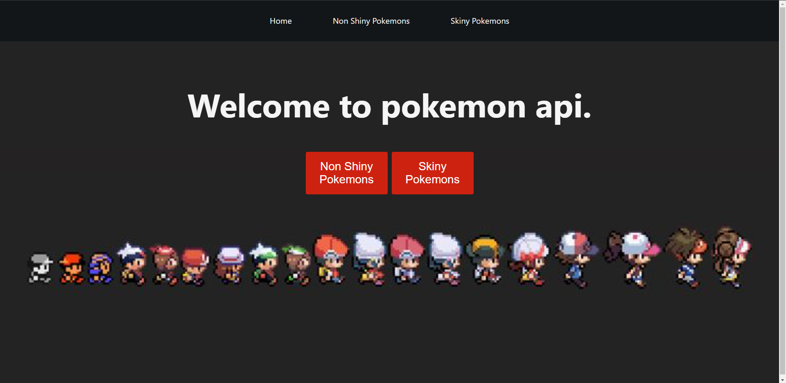
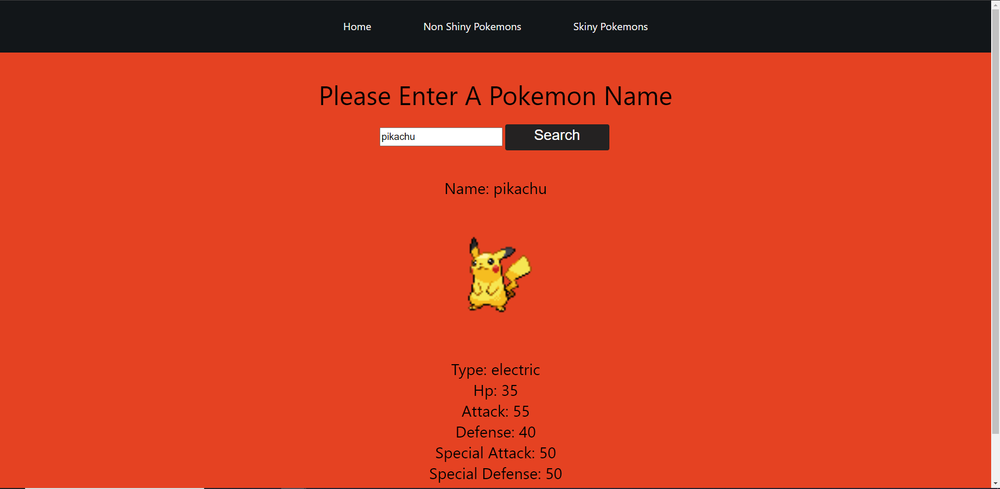
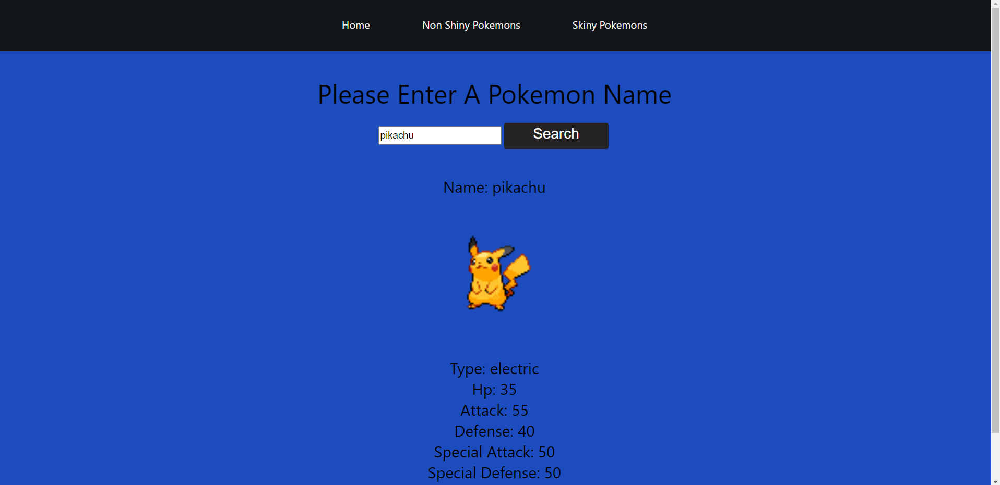

# Pokemon Api React App

This project is about a get and posting from an pokemon api.
The pokemon api is https://pokeapi.co/api/v2/pokemon/ditto.
You can find the pokemon stats and type with an img.
The shiny page will show the shiny version of the pokemon
and the non shiny page will show the non shiny version of the pokemon.

# Project Screen Shot(s)

# Installation and Setup Instructions

To clone down this repository. You will need node and npm installed globally on your machine.

Installation:
In your terminal

1. git clone https://github.com/EricBuddy/PokemonApi.git in a folder
2. cd into that folder where you did git clone
3. npm i
4. npm start
5. ctrl + c to end the react
